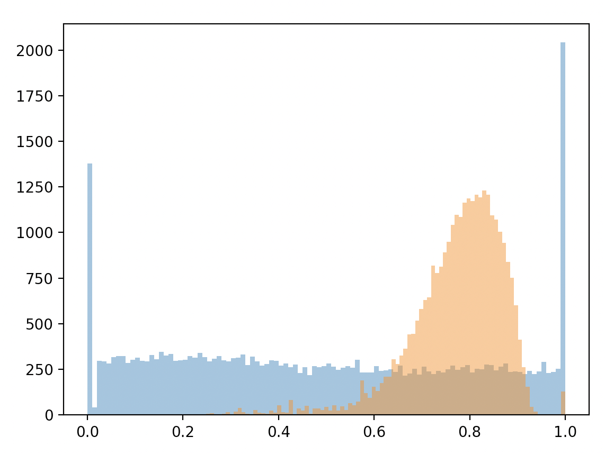
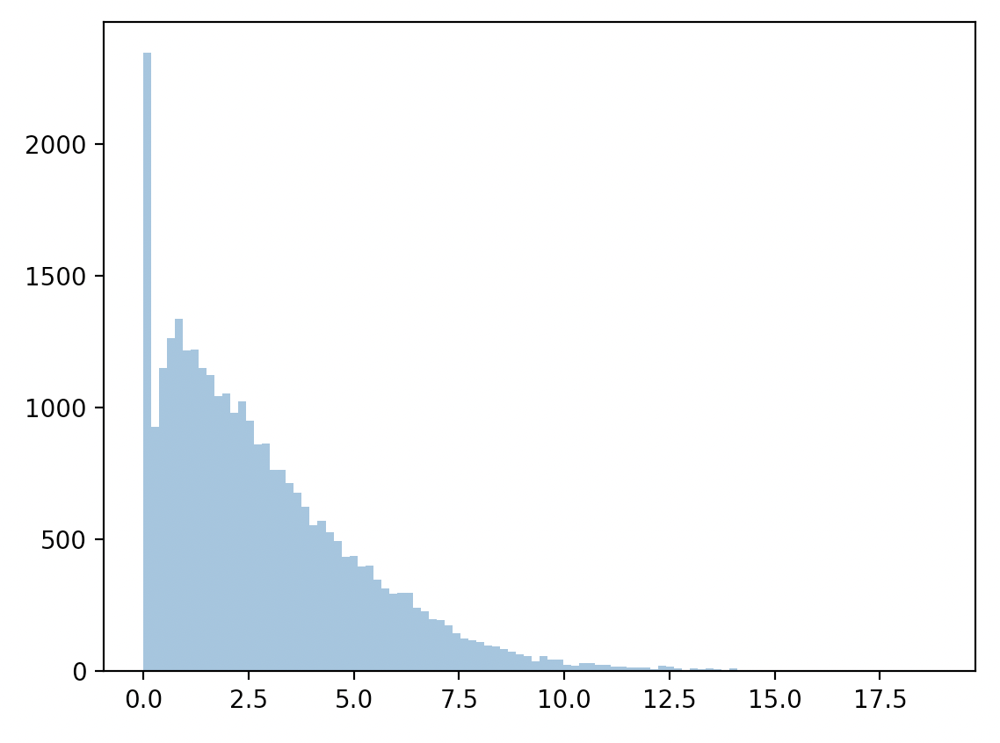
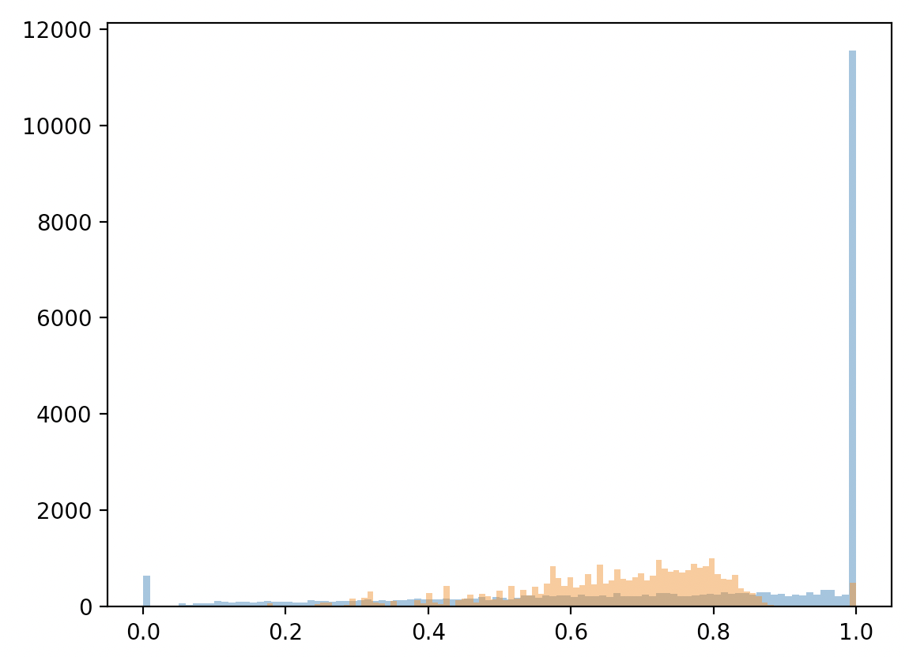
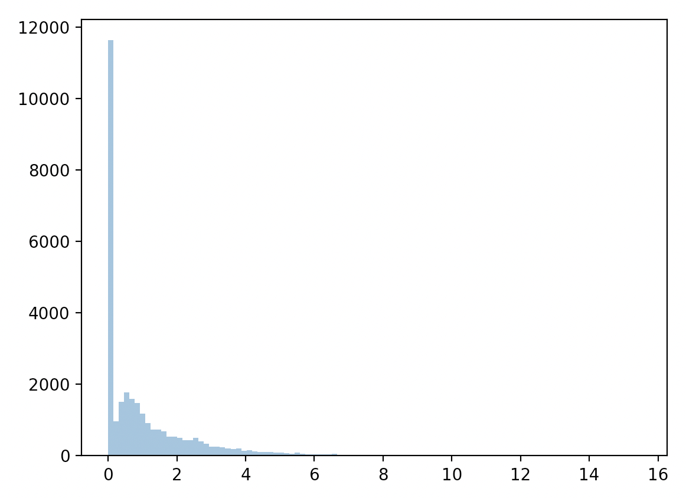

# Results so far

## June 6th, 2023

### Test 1: Only revealing first position

<!-- Include an image, images/figure1.png -->

This is a plot of "percentiles" for each choice.

<!-- Include an image, images/figure2.png -->

This is a plot of true position probability compared to the probability of guessing correctly out of all accessible spots.

- Mean percentile of true position: `0.4920896965866527`
- Mean percentile of random guess: `0.774006174201325`
- Mean ratio of $P_{true}/P_{random}$: `2.8476848092838165`

### Test 2: Revealing position every five turns

<!-- Include an image, images/figure3.png -->

This is a plot of "percentiles" for each choice.

<!-- Include an image, images/figure4.png -->

This is a plot of true position probability compared to the probability of guessing correctly out of all accessible spots.

It seems like this algorithm is only really useful for long-term probability estimation. Otherwise, it performs roughly as well as randomly choosing spots.
